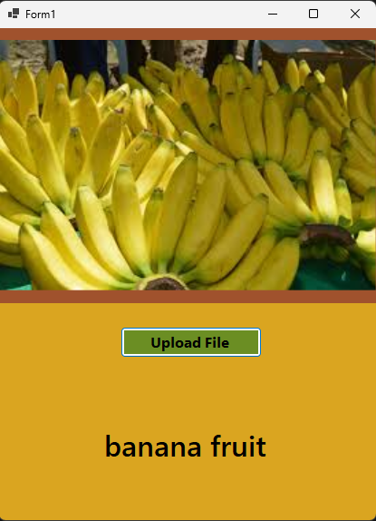
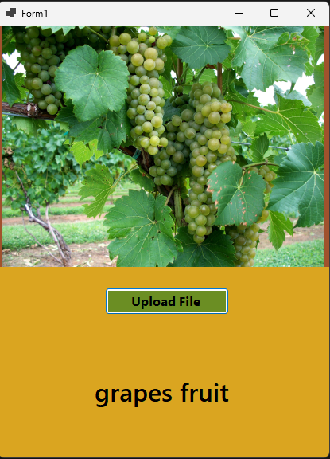

🍎 Fruit Detection System (Meyve Tanıma Sistemi)

Bu proje, WinForms ve ML.NET kullanarak resim yükleyerek meyve tespiti yapmayı amaçlamaktadır.

🚀 Özellikler

🖼 Dosya Seçme: Kullanıcı, bilgisayarından bir resim yükleyerek meyve analizi yapabilir.

🤖 ML.NET Modeli: 9 farklı meyve türü için eğitilmiş model, yüklenen resimdeki meyveyi tespit eder.

📊 Tahmin Skoru: Modelin tahmin güvenilirlik oranı görüntülenir.

📂 Kayıt Gerektirmez: Resim geçici olarak bellekte işlenmektedir, diske kaydedilmez.

📂 Kullanılan Teknolojiler

C# & WinForms

ML.NET (Makine Öğrenmesi)

OpenFileDialog (Resim seçimi için)

📜 Desteklenen Meyve Türleri (9 Adet)

✅ Elma✅ Muz✅ Portakal✅ Çilek✅ Üzüm✅ Karpuz✅ Limon✅ Armut✅ Ananas

🛠 Kurulum ve Kullanım

1. Gerekli NuGet Paketlerini Yükleyin

Install-Package Microsoft.ML
Install-Package Microsoft.ML.ImageAnalytics

2. Projeyi Çalıştırın

FruitDetection.exe dosyasını çalıştırın.

"Resim Seç" butonuna basarak bir meyve fotoğrafı yükleyin.

Model, meyveyi tahmin ederek ekranda gösterecektir.

📷 Örnek Çıktı

Resim

Tespit

Tahmin Güveni

🍏 Elma

%97.5

🍌 Muz

%92.3

🍓 Çilek

%95.8
